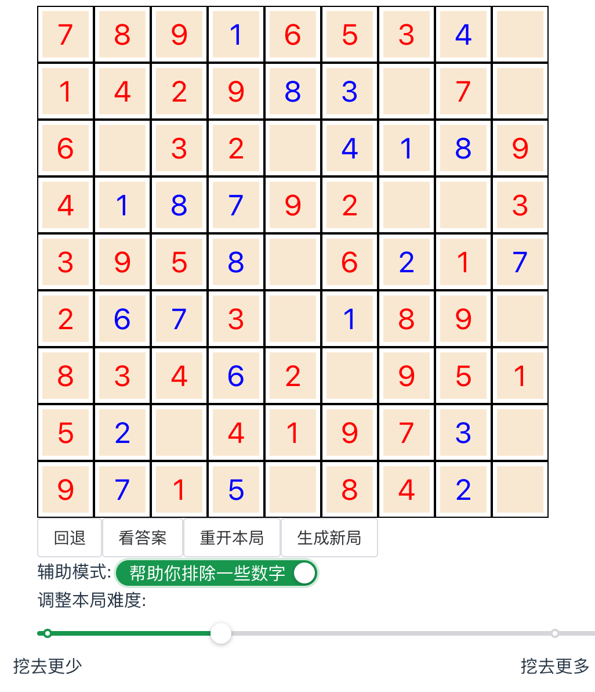

# 预览 
https://liuluopeng.github.io/sudoku



# 运行

环境: `rust` `node.js` `wasm-pack`

```
在项目目录执行: 
wasm-pack build

在vue_www目录执行:
npm install 
npm run dev 
```

# 生成唯一解数独的步骤
- 创建一个随机的数独
- 随机生成一个81个下标组成的列表
- 按照坐标顺序, 不断挖去数独中的数字, 每挖去一个数字, 验证数独是否有唯一解. 一般在20-30个空缺的时候开始出现不唯一的解. 
- 把最后出现的唯一解当做题目.